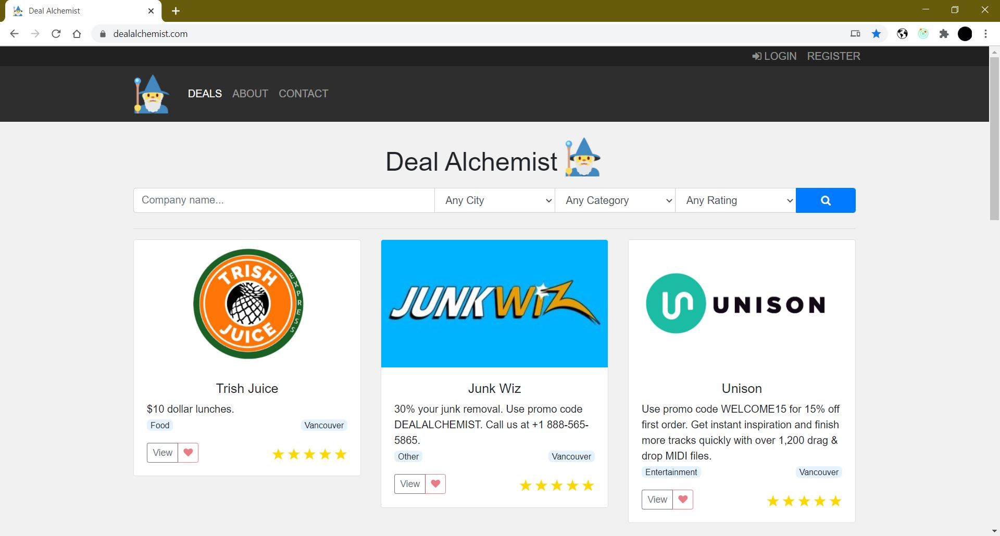

# Deal Alchemist

[HOSTED SITE HERE](https://www.dealalchemist.com/)
or
[HERE](https://deal-alchemist.herokuapp.com/)

Deal Alchemist is an online coupon book where users can sign in, favorite, review deals, and companies can share deals. The website is currently servicing real companies in a wide range of industries. The tech stack used is MongoDB, Express.js, React.js, Node.js, as well as Redux for state management, and bootstrap for the UI layout. For the express REST API, the middleware used is passport, cors, and multer. Implemented the google maps API and recaptcha API in the application.